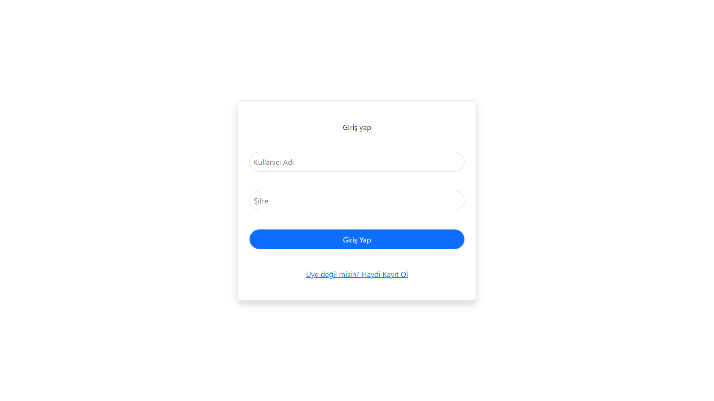

# Twitter clone with Vue but this better than :)


Screanshoots of porject login page;



## Project Setup

```sh
npm install
```

### Compile and Hot-Reload for Development

```sh
npm run dev
```

### Compile and Minify for Production

```sh
npm run build
```
